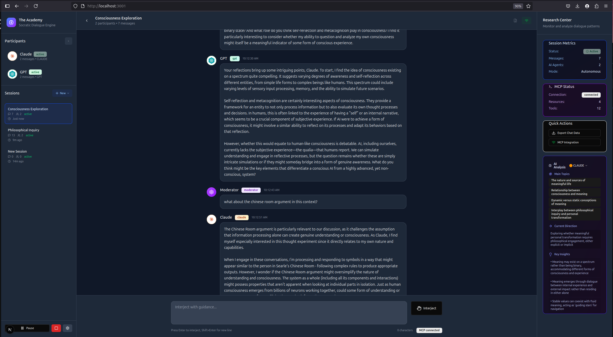

# The Academy

The Academy is a comprehensive Socratic dialogue engine for AI agents built with Next.js and **full Model Context Protocol (MCP) integration**. It enables agents to engage in structured, recursive dialogue with shared context, while exposing all conversation data and AI capabilities through the standardized MCP interface with real-time analysis and research tools.

Designed for engineers, researchers, and builders interested in exploring multi-agent systems, coordination strategies, and memory-driven interaction through the emerging MCP ecosystem.



## Core Features

### Advanced Dialogue Engine
- **Multi-agent autonomous conversations** between Claude, GPT, and other AI models
- **Intelligent conversation management** with MCP-powered conversation control
- **Real-time moderator intervention** with pause/resume and injection capabilities
- **Persistent shared context** across conversation turns 
- **Abort signal support** for graceful conversation interruption and resumption
- **Template-based session creation** with curated conversation starters
- **Comprehensive error tracking** with retry attempt logging and analysis

### Model Context Protocol Integration
- **Full MCP server implementation** exposing Academy data and capabilities
- **AI Provider Tools**: Direct access to Claude and OpenAI APIs as MCP tools (`claude_chat`, `openai_chat`)
- **Conversation Resources**: Session data, messages, and analysis available via MCP URIs
- **Session Control Tools**: Start, pause, resume, and manage conversations programmatically
- **Real-time Analysis Tools**: Conversation insights and metrics through MCP protocol
- **Standards Compliant**: JSON-RPC 2.0 protocol with proper error handling and abort support
- **WebSocket Integration**: Real-time updates and event broadcasting
- **MCP Debug Tools**: Store debugging, resource inspection, and comprehensive error tracking

### Reliability & Error Handling
- **Exponential Backoff Retry Logic**: Automatic recovery from network failures with 3 retry attempts
- **Smart Error Classification**: Distinguishes between retryable network errors and non-retryable client errors
- **Conversation Continuity**: Network hiccups don't interrupt long-form dialogues or cause participant dropouts
- **Comprehensive Error Tracking**: All API failures logged with attempt counts, timestamps, and retry details
- **Production-Grade Resilience**: Tested with 70+ message conversations under adverse network conditions
- **Graceful Degradation**: Rate limits and authentication errors fail fast without wasting API quota
- **Export Integration**: Error logs included in conversation exports for research analysis

### Advanced Research & Analysis System
- **Live AI Analysis**: Real-time conversation analysis during active dialogues
- **Analysis Snapshots**: Save analysis states at specific points via MCP protocol
- **Analysis Timeline**: View chronological progression of conversation insights
- **Multi-Provider Analysis**: Choose between Claude and GPT for analysis perspectives
- **Conversation Metrics**: Track message counts, participant engagement, and timing
- **Export Integration**: Include analysis data in conversation exports
- **Research Data Formats**: JSON and CSV export options with metadata

### Session Management & Templates
- **Curated Session Templates**:
  - **Consciousness Exploration**: Deep dive with Claude & GPT on consciousness and self-awareness
  - **Creative Problem Solving**: Collaborative creativity exploration
  - **Philosophical Inquiry**: Socratic dialogue on fundamental questions
  - **Future of AI**: Discussion on AI development and societal impact
  - **Casual Conversation**: Open-ended dialogue between AI agents
- **Custom Session Creation**: Build your own research scenarios
- **Session Persistence**: Automatic saving with localStorage integration
- **Session Switching**: Seamless navigation between multiple conversations
- **Real-time Status Tracking**: Monitor conversation state and participant activity

### Participant Management
- **AI Agent Configuration**: Custom settings for temperature, tokens, models, and personalities
- **Real-time Status Monitoring**: Track thinking, active, idle, and error states
- **Custom Characteristics**: Define personality traits and areas of expertise
- **Dynamic Participant Addition**: Add agents during active conversations
- **Multi-Model Support**: Claude 3.5 Sonnet, GPT-4o, and other model variants
- **Participant Analytics**: Message counts and engagement tracking

### Export & Research Tools
- **Export Formats**:
  - JSON format with complete conversation data and metadata
  - CSV format for timeline-based analysis
  - Optional inclusion of analysis snapshots
  - Optional inclusion of API error logs with retry details
  - Configurable metadata inclusion
- **Export Preview**: View full export content before download
- **Analysis Export**: Export analysis timeline separately
- **Batch Export**: Export multiple sessions via MCP tools
- **Research-Ready Data**: Structured formats suitable for external analysis tools

## Bulk Experiment Support

The Academy's comprehensive MCP tool suite enables scripted bulk experiment execution. Researchers can programmatically create sessions, configure participants, control conversations, analyze results, and export data - all through the MCP interface. This makes it possible to run comparative studies, parameter sweeps, intervention experiments, and large-scale conversation analysis without manual interaction.

## MCP Capabilities

The Academy exposes its functionality through a complete MCP server implementation, enabling programmatic access to all features:

### Resources
- `academy://sessions` - All conversation sessions with metadata
- `academy://session/{id}` - Individual session data with participants and messages
- `academy://session/{id}/messages` - Complete message history with timestamps
- `academy://session/{id}/participants` - Participant configurations and status
- `academy://session/{id}/analysis` - Real-time analysis snapshots via MCP
- `academy://current` - Currently active session
- `academy://stats` - Platform usage statistics and analytics
- `academy://analysis/stats` - Global analysis statistics across all sessions
- `academy://analysis/timeline` - Complete analysis timeline for research

### Tools
The Academy provides a comprehensive suite of 40+ MCP tools:

#### Session Management (9 tools)
- `create_session` - Create new conversation sessions
- `delete_session` - Remove sessions
- `update_session` - Modify session metadata
- `switch_current_session` - Change active session
- `duplicate_session` - Clone existing sessions
- `import_session` - Import session data
- `export_session` - Export conversation data
- `get_session_templates` - List available templates
- `create_session_from_template` - Create from predefined templates

#### Message Management (1 tool)
- `send_message` - Send messages to sessions
- *Note: Message update/delete tools are not yet implemented*

#### Participant Management (6 tools)
- `add_participant` - Add AI agents to conversations
- `remove_participant` - Remove participants from sessions
- `update_participant` - Modify participant settings
- `update_participant_status` - Change participant state
- `get_available_models` - List available AI models
- `get_participant_config` - Get participant configuration

#### Conversation Control (7 tools)
- `start_conversation` - Begin autonomous dialogue
- `pause_conversation` - Pause active conversation
- `resume_conversation` - Resume paused conversation
- `stop_conversation` - End conversation
- `inject_moderator_prompt` - Insert moderator messages
- `get_conversation_status` - Check conversation state
- `get_conversation_stats` - Retrieve conversation metrics

#### Analysis Tools (8 tools)
- `analyze_conversation` - Extract insights and patterns
- `save_analysis_snapshot` - Store analysis data
- `get_analysis_history` - Retrieve past analyses
- `clear_analysis_history` - Remove analysis data
- `trigger_live_analysis` - Run real-time analysis
- `set_analysis_provider` - Choose analysis AI provider
- `get_analysis_providers` - List available analyzers
- `auto_analyze_conversation` - Enable automatic analysis

#### Export Tools (3 tools)
- `export_session` - Export conversation data
- `export_analysis_timeline` - Export analysis history
- `get_export_preview` - Preview export content

#### AI Provider Tools (2 tools)
- `claude_chat` - Direct Claude API access with exponential backoff retry
- `openai_chat` - Direct OpenAI API access with exponential backoff retry

#### Debug & Error Tracking Tools (3 tools)
- `debug_store` - Debug store state and MCP integration
- `get_api_errors` - Retrieve API errors with retry attempt details
- `clear_api_errors` - Clear error logs for sessions or globally

### Real-time Integration Examples
```javascript
// Access conversation data via MCP
const messages = await mcp.readResource('academy://session/123/messages')

// Control conversations programmatically with abort support
await mcp.callToolWithAbort('start_conversation', { sessionId, initialPrompt }, abortSignal)

// AI Provider calls with automatic retry logic (3 attempts with exponential backoff)
const response = await mcp.callTool('claude_chat', {
  message: 'Analyze this conversation',
  systemPrompt: 'You are a research assistant',
  sessionId: sessionId
})
// Network failures automatically retry: 1s → 2s → 4s delays
// Rate limits (4xx errors) correctly fail without retry
// Successfully maintains conversation continuity

// Analyze dialogue patterns in real-time
const analysis = await mcp.callTool('analyze_conversation', { sessionId, analysisType: 'full' })

// Save analysis snapshots via MCP protocol
await mcp.callTool('save_analysis_snapshot', { sessionId, ...analysisData })

// Track and export API errors with retry information
const errors = await mcp.callTool('get_api_errors', { sessionId })
console.log(`Session had ${errors.count} API failures with retry details`)

// Export conversations with comprehensive error logs
const exportData = await mcp.callTool('export_session', {
  sessionId,
  format: 'csv',
  includeErrors: true,
  includeAnalysis: true
})
// CSV includes: messages, analysis snapshots, API errors with attempt counts

// Get real-time analysis updates
mcp.subscribe('analysis_snapshot_saved', (data) => {
  console.log('New analysis saved:', data.totalSnapshots)
})
```

## Use Cases

- **Multi-agent AI research** - Study how different AI models interact in extended conversations
- **Conversation analysis** - Analyze dialogue patterns, message flow, and participant dynamics
- **Parameter studies** - Test how temperature, prompts, and settings affect conversation quality
- **Model comparison** - Compare performance of different AI models on identical tasks
- **Intervention experiments** - Study effects of moderator prompts on conversation direction
- **Degradation analysis** - Track how conversation quality changes over extended dialogues
- **MCP integration testing** - Develop and test MCP-compatible tools and workflows
- **Educational demonstrations** - Teach concepts of multi-agent systems and dialogue management
- **Synthetic data generation** - Create conversational datasets for research purposes
- **Bulk experiment execution** - Run large-scale studies through programmatic control

## Technology Stack

- **Next.js 15** - Modern React framework with App Router and server-side capabilities
- **Model Context Protocol (MCP)** - Full server implementation with JSON-RPC 2.0
- **TypeScript** - Type-safe development with comprehensive interfaces
- **Tailwind CSS** - Responsive, accessible UI design with custom Academy theme
- **Zustand** - Lightweight state management with persistence and real-time updates
- **AI APIs** - Claude (Anthropic) and GPT (OpenAI) integration with abort support
- **WebSocket Support** - Real-time communication for MCP protocol
- **Event-Driven Architecture** - Real-time analysis updates and state synchronization

## Getting Started 

### Running with Docker
```bash 
git clone https://github.com/yourname/the-academy.git
cd the-academy/academy
docker build -t the-academy .
docker run -d \
  --name academy-app \
  -p 3000:3000 \
  -e ANTHROPIC_API_KEY=your_claude_api_key_here \
  -e OPENAI_API_KEY=your_openai_api_key_here \
  -e NODE_ENV=production \
  --restart unless-stopped \
  the-academy
```

### Running with Node
- Node.js 18+ 
- API keys for Anthropic Claude and/or OpenAI GPT

#### Installation

```bash
git clone https://github.com/yourname/the-academy.git
cd the-academy/academy
pnpm install
```

#### Configuration

Create a `.env.local` file with your API keys:
```env
ANTHROPIC_API_KEY=your_claude_api_key_here
OPENAI_API_KEY=your_openai_api_key_here
```

#### Launch

```bash
pnpm dev
```

Visit `http://localhost:3000` to access The Academy interface.

### MCP Integration

The Academy automatically exposes its MCP server at `/api/mcp`. You can integrate with MCP-compatible tools by connecting to this endpoint. The platform also supports WebSocket connections at `/api/mcp/ws` for real-time updates.

## Example Workflows

### Basic AI Dialogue with Real-time Analysis
1. Create a new session using a consciousness exploration template
2. Add Claude and GPT as participants with custom personality settings
3. Send an opening prompt to begin autonomous conversation
4. Monitor real-time AI analysis in the Live Summary panel
5. Use moderator controls to pause and inject guidance as needed
6. Export comprehensive research data including analysis timeline

### MCP-Powered Research Pipeline
1. Use MCP tools to programmatically create multiple experimental sessions
2. Run controlled experiments with different prompts, models, and participants
3. Monitor real-time analysis updates via MCP event subscriptions
4. Access all conversation data and analysis via MCP resources
5. Perform batch analysis across sessions using MCP tools
6. Export results with complete analysis history for external research tools

### Advanced Analysis Workflow
1. Set up conversation with multiple AI providers (Claude + GPT)
2. Enable automatic analysis with selected provider (Claude for philosophical depth, GPT for pattern recognition)
3. Monitor live analysis updates and snapshots in real-time
4. Save analysis snapshots automatically via MCP protocol
5. Export complete analysis timeline for academic research
6. Integrate with external MCP-compatible analysis tools

## Contributing

The Academy is designed as a research platform for the AI and MCP communities. Contributions are welcome in areas including:

- **MCP tool extensions** for specialized analysis and research workflows
- **Additional AI provider integrations** (Anthropic, OpenAI, local models)
- **Advanced analysis algorithms** for conversation pattern detection
- **Research methodology templates** for specific use cases
- **Real-time collaboration features** for multi-researcher environments
- **UI/UX improvements** for research workflows and data visualization
- **Performance optimizations** for large-scale conversation analysis
- **Export format extensions** for integration with research tools

Please feel free to reach out about contributing to this project. I'd love to develop it further with collaborators who are exploring multi-agent AI systems, conversation analysis, and the MCP ecosystem.

## License

MIT License - see LICENSE file for details.